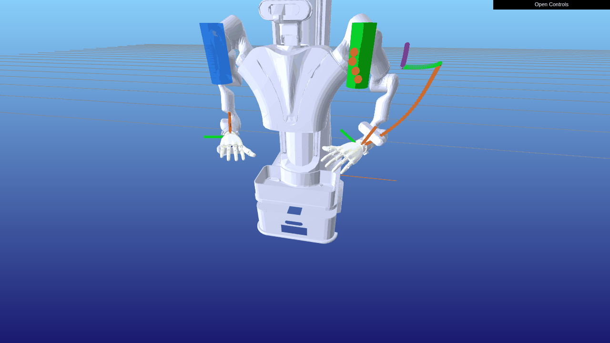

# Robot-Harness

**A Visual Testing Harness for AI Coding Agents in Robot Simulation**

[](https://github.com/MiaoDX/RobotHarness/actions/workflows/ci.yml)
[](LICENSE)
[](https://www.python.org/downloads/)
[](https://github.com/MiaoDX/RobotHarness/stargazers)

> Let Claude Code and Codex **see** what the robot is doing, **judge** if it's working, and **iterate** autonomously.

## Demo

**Grasp Task: X32_Y28_Z13 (Front View)**


*Agent-in-the-loop: Plan → Pregrasp → Approach → Close → Lift → Holding*

**Grasp Task: X26_Y22_Z13 (Front View)**



*Multi-checkpoint visual verification — each frame is a checkpoint where the AI Agent observes and judges*

## What is Robot-Harness?

Robot-Harness is a framework that lets AI Coding Agents (Claude Code, OpenAI Codex, etc.) control robot simulations through a **visual feedback loop**:

```
Agent writes control code
    → Harness runs simulation
    → Pauses at checkpoints
    → Captures multi-view screenshots
    → Agent observes & judges
    → Agent modifies code & retries
    → Loop until task succeeds
```

**Key insight**: Modern coding agents are already multimodal — they can write code AND see images AND make decisions. We don't need a separate VLM. Robot-Harness just needs to present simulation visuals in a format agents can directly consume.

## Installation

```bash
pip install robot-harness

# With MuJoCo + Meshcat backend
pip install robot-harness[mujoco]

# Development
pip install robot-harness[dev]
```

## Quick Start

### Option 1: Gymnasium Wrapper (Zero-Change Integration)

Wrap any Gymnasium-compatible environment with one line:

```python
import gymnasium as gym
from robot_harness.wrappers import RobotHarnessWrapper

env = gym.make("CartPole-v1", render_mode="rgb_array")
env = RobotHarnessWrapper(env,
    checkpoints=[
        {"name": "early", "step": 10},
        {"name": "mid", "step": 50},
        {"name": "late", "step": 100},
    ],
    output_dir="./harness_output",
)

obs, info = env.reset()
for _ in range(200):
    obs, reward, terminated, truncated, info = env.step(env.action_space.sample())
    if "checkpoint" in info:
        print(f"Checkpoint '{info['checkpoint']['name']}' captured!")
        print(f"  → {info['checkpoint']['capture_dir']}")
```

### Option 2: Core Harness API (Full Control)

For custom simulator integrations:

```python
from robot_harness import Harness
from robot_harness.backends.mujoco_meshcat import MuJoCoMeshcatBackend

backend = MuJoCoMeshcatBackend(
    model_path="robot.xml",
    cameras=["front", "side", "top"],
)
harness = Harness(backend, output_dir="./harness_output", task_name="pick_and_place")

harness.add_checkpoint("pre_grasp", cameras=["front", "side", "top"])
harness.add_checkpoint("contact", cameras=["front", "wrist"])
harness.add_checkpoint("lift", cameras=["front", "side", "top"])

harness.reset()
result = harness.run_to_next_checkpoint(actions)
# result.views → multi-view screenshots
# result.state → joint angles, poses, contacts
```

### Grasp Task Storage

For tasks with multiple grasp positions, each with multiple agent retry trials:

```python
from robot_harness.storage import GraspTaskStore

store = GraspTaskStore(base_dir="./output", task_name="pick_and_place")
store.add_grasp_position(position_id=1, xyz=(0.5, 0.0, 0.05), object_name="red_cube")
```

Output directory structure:

```
harness_output/
└── pick_and_place/
    ├── task_config.json
    ├── grasp_position_001/
    │   ├── position.json              # grasp pose (xyz + quaternion)
    │   ├── trial_001/
    │   │   ├── plan_start/
    │   │   │   ├── front_rgb.png
    │   │   │   ├── side_rgb.png
    │   │   │   ├── state.json
    │   │   │   └── metadata.json
    │   │   ├── contact/
    │   │   ├── lift/
    │   │   └── result.json
    │   ├── trial_002/                 # agent's second attempt
    │   └── summary.json
    ├── grasp_position_002/
    └── report.json
```

## Supported Simulators

| Simulator | Status | Integration |
|-----------|--------|-------------|
| MuJoCo + Meshcat | ✅ Implemented | Native backend adapter |
| Isaac Lab | 🚧 Planned | Gymnasium Wrapper (1 line) |
| ManiSkill | 🚧 Planned | Gymnasium Wrapper |
| LocoMuJoCo | 📋 Roadmap | Gymnasium Wrapper |
| MuJoCo Playground | 📋 Roadmap | JAX-native adapter |
| unitree_rl_gym | 📋 Roadmap | MuJoCo sim-to-sim wrapper |

## Architecture

```
robot_harness/
├── core/
│   ├── harness.py         # Main Harness class + SimulatorBackend protocol
│   ├── checkpoint.py      # Checkpoint management & state snapshots
│   └── capture.py         # Multi-view screenshot capture & storage
├── backends/
│   └── mujoco_meshcat.py  # MuJoCo + Meshcat reference backend
├── wrappers/
│   └── gymnasium_wrapper.py  # Drop-in Gymnasium wrapper
└── storage/
    └── task_store.py      # Task-oriented storage (GraspTaskStore, etc.)
```

**Design principles:**
- **Harness only does "pause → capture → resume"** — agent logic stays in your code
- **Gymnasium Wrapper for zero-change integration** — works with Isaac Lab, ManiSkill, etc.
- **SimulatorBackend protocol for custom integrations** — implement 7 methods, done
- **Agent-consumable output** — PNG images + JSON state files that any agent can `ls` and read

## Background

This project is inspired by:
- **Anthropic's Harness Engineering** (Nov 2025, Mar 2026) — Building effective harnesses for long-running agents
- **OpenAI's Harness Engineering** — Using Codex in an agent-first world
- **AOR** (Act-Observe-Rewrite, 2025) — Multi-modal LLM receives RGB images + diagnostics, outputs controller code

See [docs/context.en.md](docs/context.en.md) for the full background and motivation.
See [docs/simulator-survey.en.md](docs/simulator-survey.en.md) for the simulator compatibility analysis.

## Contributing

Contributions welcome! See [CONTRIBUTING.md](CONTRIBUTING.md) for guidelines.

We especially welcome:
- New simulator backend adapters
- Real-world usage examples
- Integration with popular RL libraries (SB3, CleanRL, etc.)

## License

MIT
