<div align="center">

# Roboharness

**A Visual Testing Harness for AI Coding Agents in Robot Simulation**

[](https://github.com/MiaoDX/RobotHarness/actions/workflows/ci.yml)
[](https://pypi.org/project/roboharness/)
[](LICENSE)
[](https://www.python.org/downloads/)

> Let Claude Code and Codex **see** what the robot is doing, **judge** if it's working, and **iterate** autonomously.

<table>
<tr>
<td align="center"><b>Front View</b><br/>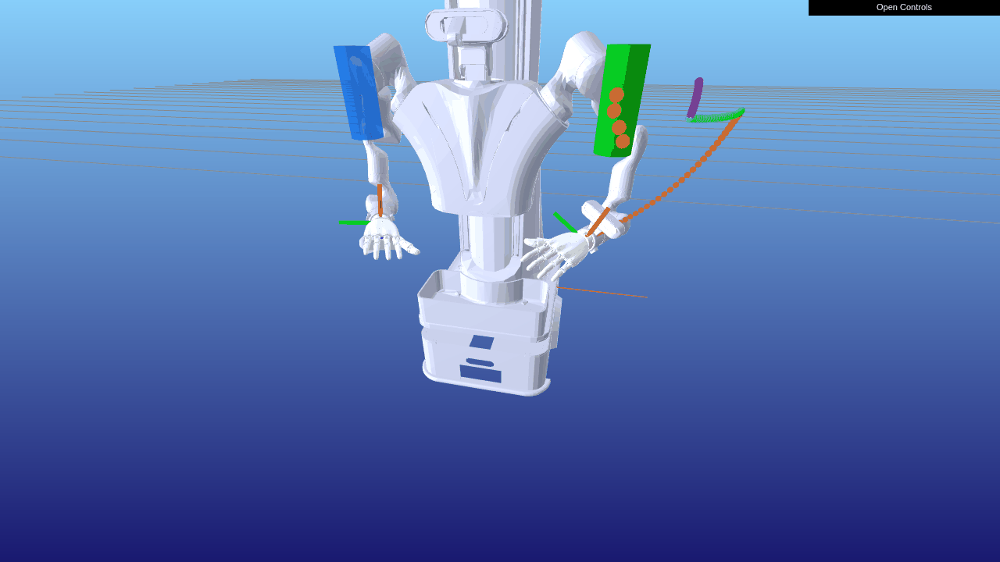<br/><sub>Plan → Pregrasp → Approach → Close → Lift → Holding</sub></td>
<td align="center"><b>Top-Down View</b><br/>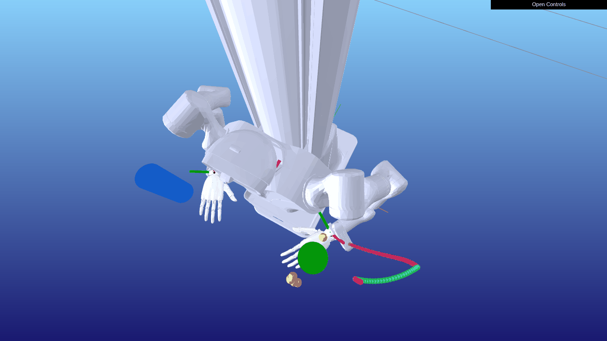<br/><sub>Top-down view: object alignment and grasp closure</sub></td>
</tr>
</table>

<p>
  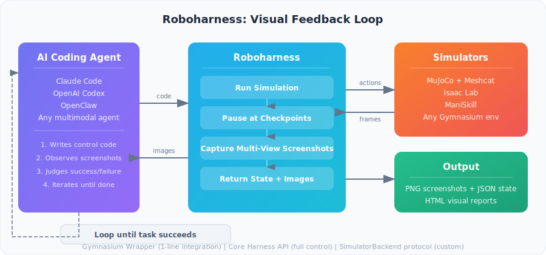
</p>

</div>

## Installation

```bash
pip install roboharness                  # core (numpy only)
pip install roboharness[mujoco]          # + MuJoCo backend
pip install roboharness[mujoco,rerun]    # + Rerun logging
pip install roboharness[dev]             # development (pytest, ruff, mypy)
pip install roboharness[all]             # everything (MuJoCo, WBC, LeRobot, Rerun)
```

## Quick Start

### MuJoCo Grasp Example

```bash
pip install roboharness[mujoco] Pillow
python examples/mujoco_grasp.py --report
```

> **[View the interactive visual report online](https://miaodx.com/roboharness/)** — auto-generated from CI on every push to main.

| pre_grasp | contact | grasp | lift |
|:-:|:-:|:-:|:-:|
| 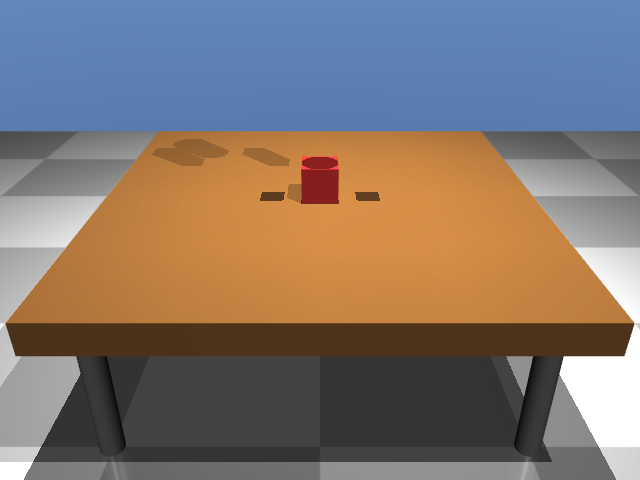 | 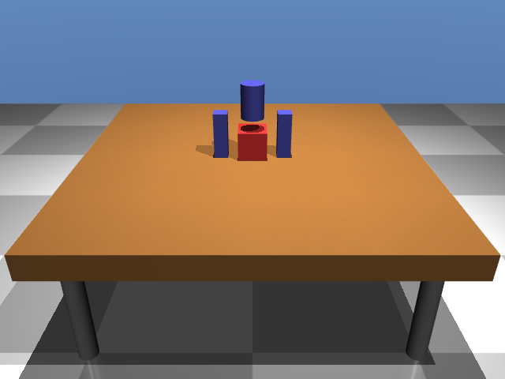 | 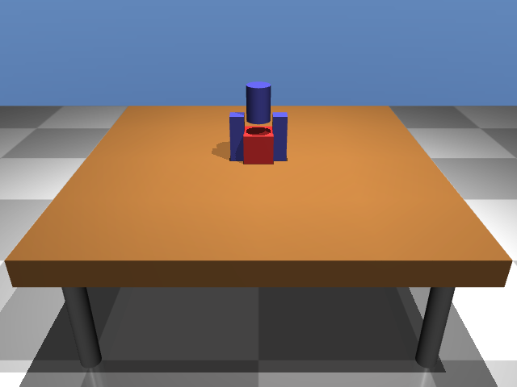 | 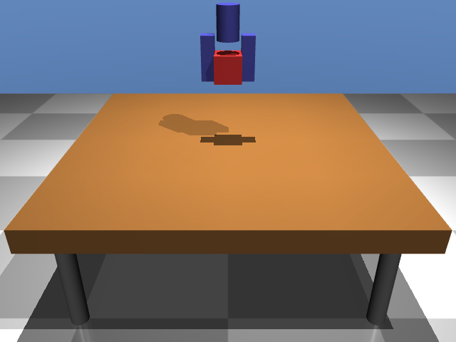 |
| Gripper above cube | Lowered onto cube | Fingers closed | Cube lifted |

### G1 Humanoid WBC Reach

```bash
pip install roboharness[mujoco,wbc] robot_descriptions Pillow
python examples/g1_wbc_reach.py --report
```

Whole-body control (WBC) for the Unitree G1 humanoid using Pinocchio + Pink differential-IK for upper-body reaching while maintaining lower-body balance. The controller solves inverse kinematics for both arms simultaneously, letting the robot reach arbitrary 3D targets without falling over.

| stand | reach_left | reach_both | retract |
|:-:|:-:|:-:|:-:|
| 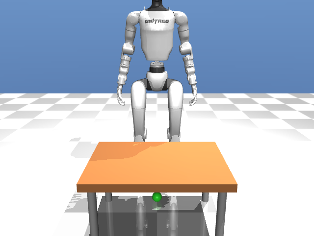 | 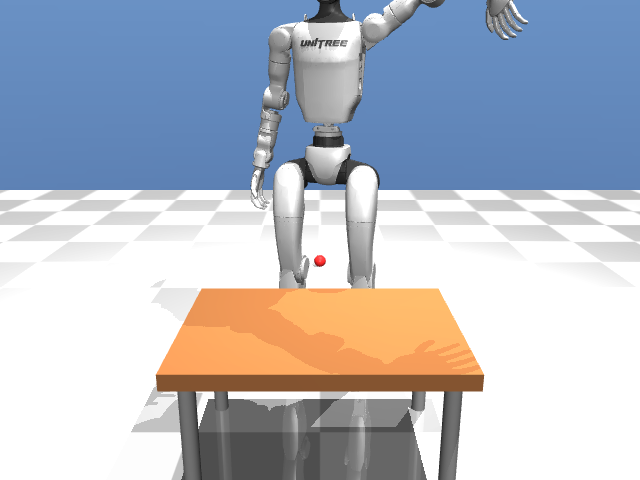 | 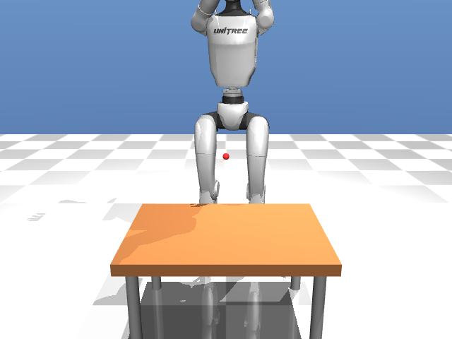 | 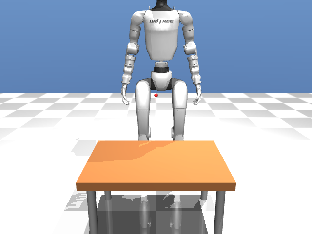 |

### LeRobot G1 Locomotion

```bash
pip install roboharness[lerobot] robot_descriptions Pillow
python examples/lerobot_g1.py --report
```

Integrates the real [Unitree G1 43-DOF model](https://huggingface.co/lerobot/unitree-g1-mujoco) from HuggingFace with GR00T WBC locomotion policies (Balance + Walk). The example downloads the model and ONNX policies automatically, runs the G1 through stand → walk → stop phases, and captures multi-camera checkpoints via `RobotHarnessWrapper`.

### Gymnasium Wrapper (Zero-Change Integration)

```python
import gymnasium as gym
from roboharness.wrappers import RobotHarnessWrapper

env = gym.make("CartPole-v1", render_mode="rgb_array")
env = RobotHarnessWrapper(env,
    checkpoints=[{"name": "early", "step": 10}, {"name": "mid", "step": 50}],
    output_dir="./harness_output",
)

obs, info = env.reset()
for _ in range(200):
    obs, reward, terminated, truncated, info = env.step(env.action_space.sample())
    if "checkpoint" in info:
        print(f"Checkpoint '{info['checkpoint']['name']}' captured!")
```

### Core Harness API

```python
from roboharness import Harness
from roboharness.backends.mujoco_meshcat import MuJoCoMeshcatBackend

backend = MuJoCoMeshcatBackend(model_path="robot.xml", cameras=["front", "side"])
harness = Harness(backend, output_dir="./output", task_name="pick_and_place")

harness.add_checkpoint("pre_grasp", cameras=["front", "side"])
harness.add_checkpoint("lift", cameras=["front", "side"])
harness.reset()
result = harness.run_to_next_checkpoint(actions)
# result.views → multi-view screenshots, result.state → joint angles, poses
```

## Supported Simulators

| Simulator | Status | Integration |
|-----------|--------|-------------|
| MuJoCo + Meshcat | ✅ Implemented | Native backend adapter |
| LeRobot (G1 MuJoCo) | ✅ Implemented | Gymnasium Wrapper + Controllers |
| Isaac Lab | 🚧 Planned | Gymnasium Wrapper |
| ManiSkill | 🚧 Planned | Gymnasium Wrapper |
| LocoMuJoCo / MuJoCo Playground / unitree_rl_gym | 📋 Roadmap | Various |

## Design Principles

- **Harness only does "pause → capture → resume"** — agent logic stays in your code
- **Gymnasium Wrapper for zero-change integration** — works with Isaac Lab, ManiSkill, etc.
- **SimulatorBackend protocol** — implement a few methods, plug in any simulator
- **Agent-consumable output** — PNG + JSON files that any coding agent can read

See [docs/context.en.md](docs/context.en.md) for full background and motivation.

## Contributing

Contributions welcome — including from AI coding agents! See [CONTRIBUTING.md](CONTRIBUTING.md).

## License

MIT
